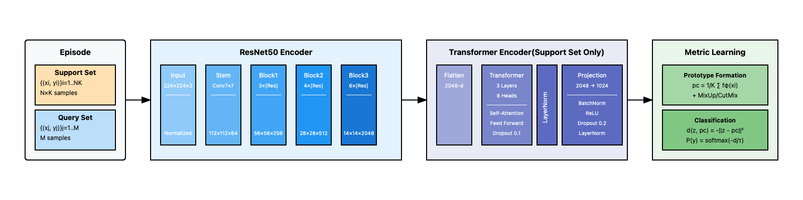

# 🌸 BloomLens: Few-shot Learning for Fine-grained Flower Classification with Prototypical Networks

[📖 Paper](docs/report.pdf) | [🎯 Models](src/models/prototypical_network.py) | [📊 Results](results/prototypical_results.md) |

> A Course Project for Nanyang Technological University, SC4001 CE/CZ4042: Neural Networks and Deep Learning


## 🌟 Highlights

- 🚀 **93.64%** accuracy on **5-way 1-shot** tasks
- 🎯 **85.51%** accuracy on **20-way 1-shot** tasks
- 📈 Scales to **40-way** tasks with **78.29%** accuracy
- 🔄 Progressive training from **5-way** to **20-way**
- 🤖 Transformer-enhanced feature adaptation
- 🎨 Smart augmentation with **MixUp** and **CutMix**

## 🤖 Model Components


## 📊 Performance on Oxford Flowers-102
> Note: the specific data split is explained in the paper

| Model                                   | 5-way 1-shot   | 5-way 5-shot   | 20-way 1-shot  | 20-way 5-shot  |
|-----------------------------------------|-----------------|-----------------|-----------------|-----------------|
| AlexNet                                 | 41.95 ± 2.01    | 52.16 ± 2.16    | 17.13 ± 0.76    | 22.75 ± 0.78    |
| ResNet18                                | 57.59 ± 2.18    | 68.61 ± 2.29    | 31.39 ± 1.07    | 42.61 ± 0.97    |
| ResNet50                                | 54.21 ± 2.23    | 63.95 ± 2.30    | 27.90 ± 0.94    | 38.16 ± 0.98    |
| DenseNet121                             | 55.16 ± 2.08    | 67.61 ± 2.06    | 31.61 ± 1.08    | 43.69 ± 0.96    |
| DenseNet201                             | 58.52 ± 2.36    | 69.51 ± 2.06    | 31.97 ± 1.20    | 44.47 ± 1.05    |
| Bayesian Prompt | 70.40 ± 1.80    | 73.50 ± 1.50    | -               | -               |
| **BloomLens (Ours)**                   | **93.64 ± 6.86**| **95.88 ± 5.20**| **85.51 ± 5.77**| **89.66 ± 4.00**|

## 🚀 Quick Start

### Installation
```bash
# Clone the repository
git clone https://github.com/Ry3nG/BloomLens.git

# Create conda environment
conda env create -f environment.yml

# Activate conda environment
conda activate bloomlens

```

### Training
```python
python src/training/train_prototypical.py
```

### Testing
```python
# Testing Prototypical Network
python src/evaluation/evaluate_prototypical.py
# Testing Baseline Model
python scripts/baseline_comparison_multimodel.py

```

## Project Structure

```
BloomLens/
├── 📂 results/
├── 📂 scripts/
├── 📂 src/
│   ├── 📂 data/
│   ├── 📂 evaluation/
│   ├── 📂 models/
│   └── 📂 training/
├── 📂 docs/
│   └── 📂 diagrams/
├── 📄 environment.yml
└── 📄 README.md
```

## 📊 Monitoring
Training progress can be monitored using wandb.

```bash
wandb login # login to wandb
```
```python
import wandb
wandb.init(project="bloomlens")
```


